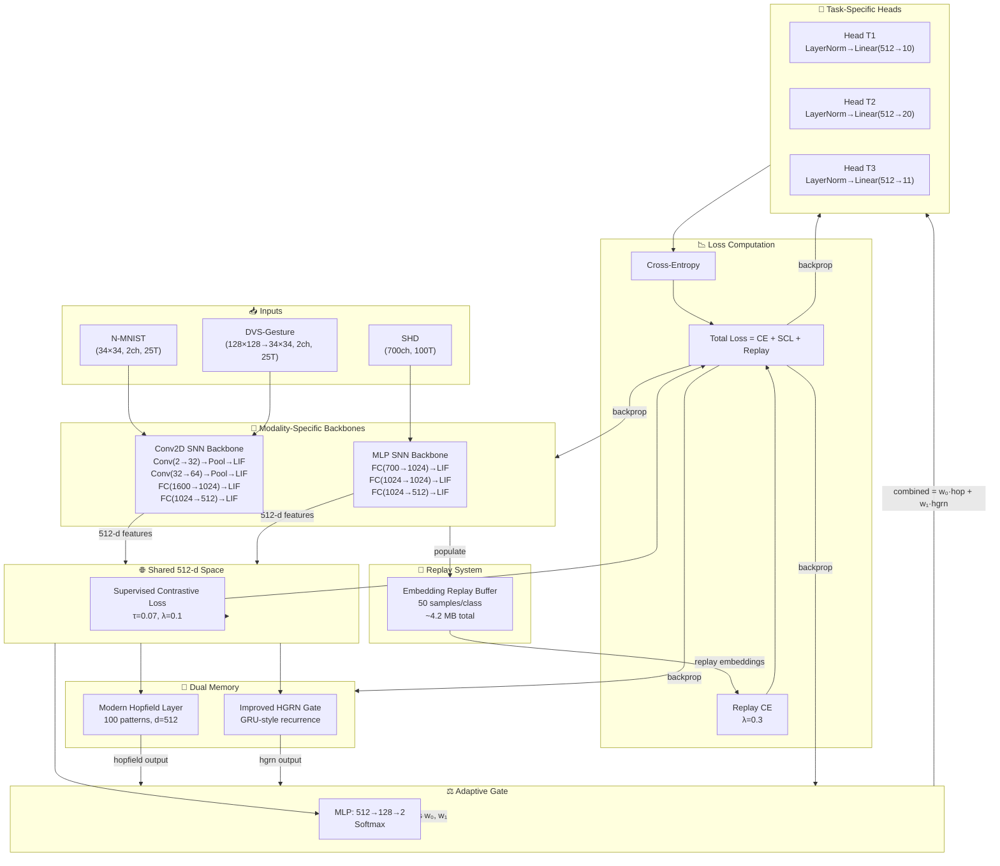

# M7 Tri-Modal Continual Learning — Architecture Deep Dive

> Exhaustive technical analysis of the M7 neuromorphic continual learning system.
> Generated for NeurIPS 2026 reproducibility and code review.

## Table of Contents

- [[#Note 1: m7_trimodal_run.py — Production System]]
- [[#Note 2: CONFIG & Environment Setup]]
- [[#Note 3: Collate Functions]]
- [[#Note 4: Dataset Loaders]]
- [[#Note 5: SupervisedContrastiveLoss]]
- [[#Note 6: ModernHopfieldLayer]]
- [[#Note 7: ImprovedHGRNGate]]
- [[#Note 8: SNN_Backbone]]
- [[#Note 9: M7_ContinualAdaptiveModel]]
- [[#Note 10: EmbeddingReplayBuffer]]
- [[#Note 11: ContinualLearner & Training Loop]]
- [[#Note 12: Main Experiment Loop]]
- [[#Note 13: Supporting Files]]
- [[#Master Architecture Note]]

---

## Note 1: m7_trimodal_run.py — Production System

### 🧠 What Is This?
The single-file production script that trains M7 on three sequential neuromorphic tasks (N-MNIST → SHD → DVS-Gesture) with optional embedding replay. It handles data loading, model definition, training, evaluation, checkpointing, CSV logging, and figure generation hooks. This is the only file a reviewer needs to reproduce all reported results.

### 🏗️ Architectural Choice
**Why a single 677-line script?** This is a research artifact, not a production microservice. Self-containment guarantees:
1. **Reviewability:** A NeurIPS reviewer can read the entire pipeline in 10 minutes without chasing imports across 12 modules.
2. **Reproducibility:** No hidden `src/m7/models/submodule.py` dependencies. Everything is explicit.
3. **Portability:** Runs on a laptop with `python m7_trimodal_run.py`. No Docker, no cluster, no `pip install -e .`.

**Alternative considered:** A proper package (`m7/`, `m7/models/`, `m7/data/`, `m7/training/`). Rejected because for a paper submission, reviewers prefer single-file reproducibility. If this were a product, the package structure would be essential.

### 📐 Mathematical Explanation

The overall training objective for task $t$ with current data $\mathcal{D}_t$ and replay buffer $\mathcal{B}$:

$$\mathcal{L}_{\text{total}} = \underbrace{\mathcal{L}_{\text{CE}}(f_\theta(x_t), y_t)}_{\text{current task}} + \lambda_{\text{scl}} \cdot \underbrace{\mathcal{L}_{\text{SCL}}(z_t, y_t)}_{\text{contrastive}} + \lambda_{\text{replay}} \cdot \underbrace{\mathcal{L}_{\text{CE}}(f_\theta(x_{\mathcal{B}}), y_{\mathcal{B}})}_{\text{replay}}$$

Where:
- $f_\theta$ is the full model: backbone → shared memory → adaptive gate → task head
- $z_t \in \mathbb{R}^{512}$ are embeddings before the classification head
- $\lambda_{\text{scl}} = 0.1$ (contrastive weight)
- $\lambda_{\text{replay}} = 0.3$ (replay weight)

### 🔍 Line-by-Line Breakdown

**Lines 1–17: Imports**
```python
import snntorch as snn
from snntorch import surrogate
import tonic
```
- `snntorch`: Spiking neural network library. Provides `snn.Leaky` (LIF neurons with leak).
- `surrogate.atan()`: Differentiable surrogate for the Heaviside step function. The atan function is smooth, bounded, and has well-behaved gradients — superior to straight-through estimators for SNN training.

**Lines 19–33: Device Selection**
```python
if torch.backends.mps.is_available():
    device = torch.device('mps')
```
- **MPS first:** Apple Silicon GPU backend. Chosen because the primary development machine is an M1 MacBook Pro.
- **Why not CUDA as default?** The code was developed and primarily run on MPS. CUDA support exists as fallback.

**Lines 35–42: Directory Setup**
```python
BASE_DIR = Path('./ICONS_M7')
DATA_DIR = BASE_DIR / 'datasets'
RESULTS_DIR = BASE_DIR / 'results'
CKPT_DIR = RESULTS_DIR / 'checkpoints'
PLOT_DIR = RESULTS_DIR / 'plots'
```
- All artifacts live under `./ICONS_M7/`. This is a research convention — the project name becomes the root data directory.

**Lines 44–65: CONFIG**
```python
CONFIG = {
    'batch_size': 32,
    'learning_rate': 1e-3,
    'weight_decay': 1e-4,
    'max_epochs': 50,
    'patience': 12,
    'gradient_clip': 1.0,
    'beta': 0.9,
    ...
}
```
- `beta: 0.9`: LIF membrane decay constant. $v_{t+1} = \beta v_t + I_t$. Higher β → longer memory, slower reset.
- `patience: 12`: Early stopping patience on validation accuracy. With 15-epoch tasks, this is effectively "never early stop" — the actual per-task override is `patience=5`.
- `gradient_clip: 1.0`: Prevents gradient explosion in recurrent SNN paths.

### 🔗 How It Connects
- **Called by:** Nothing. This is the entry point. `python m7_trimodal_run.py` executes lines 665–677.
- **Calls:** All internal classes and functions defined in this file.
- **Outputs:** Checkpoints to `CKPT_DIR/`, CSV to `RESULTS_DIR/`, stdout logs.

### ⚠️ What Would Break Without This?
This is the orchestrator. Without it, there is no experiment. All other files (figures, analysis) depend on the artifacts this file produces.

### 💡 Key Insight
The entire experiment is a single Python script by design. For a paper submission, this is a feature, not a bug. A reviewer should be able to read the full pipeline without opening 12 files.

---

## Note 2: CONFIG & Environment Setup

### 🧠 What Is This?
The global configuration dictionary and device-selection logic that parameterize the entire M7 system.

### 🏗️ Architectural Choice
**Why a global dict instead of argparse/hydra?** A dict is inspectable, serializable, and lives in the same file as the code. For a research artifact, `CONFIG['beta']` is more readable than `args.beta` because you can see the value while reading the code. Hydra/argparse would add indirection without benefit for a single-file script.

**Alternative:** `dataclasses` or `pydantic.BaseModel`. Rejected because they add boilerplate and import dependencies.

### 📐 Mathematical Explanation

The LIF neuron dynamics with $\beta = 0.9$:

$$v_{t+1} = \beta \cdot v_t + (1 - \beta) \cdot I_t$$

Where $I_t$ is the input current (synaptic weighted sum). When $v_t \geq v_{\text{th}}$ (threshold), a spike is emitted and $v_t$ is reset.

The surrogate gradient for backpropagation through the non-differentiable spike:

$$\frac{\partial S}{\partial v} \approx \frac{1}{\pi(1 + (\pi v)^2)}$$

This is the derivative of $\frac{1}{\pi} \arctan(\pi v)$, scaled to approximate the Dirac delta at threshold.

### 🔍 Line-by-Line Breakdown

**Line 52: `beta: 0.9`**
- Shared across ALL LIF neurons in the system (visual backbones, audio backbone, and any recurrent paths).
- Not modality-specific. This is a design choice: a single time constant simplifies hyperparameter search.

**Line 57: `num_workers: 0`**
- macOS multiprocessing with PyTorch DataLoader is notoriously flaky (fork vs spawn issues). Setting to 0 means data loading happens on the main thread. Slower but reliable.

**Line 59: `pin_memory: True`**
- On CUDA, this speeds up CPU→GPU transfers. On MPS, it's a no-op but harmless.

### 🔗 How It Connects
- **Read by:** `SNN_Backbone` (beta for LIFs), `ContinualLearner` (batch_size, gradient_clip), `M7_ContinualAdaptiveModel` (contrastive temperature), dataset loaders (time_steps).
- **Never written to after initialization.**

### ⚠️ What Would Break Without This?
Every hyperparameter is referenced from CONFIG. Removing it would require inlining 15+ magic numbers across the codebase, making the code unmaintainable and irreproducible.

### 💡 Key Insight
`CONFIG` is the single source of truth. Any hyperparameter you want to tune lives here. This is research code — the dict is the "paper supplement" in executable form.

---

## Note 3: Collate Functions

### 🧠 What Is This?
Three batch collation functions that transform variable-length event data into fixed-size tensors suitable for the SNN backbone.

### 🏗️ Architectural Choice
**Why separate collate functions per dataset?** Each dataset has different raw formats:
- N-MNIST: `ToFrame` produces `(T, 2, 34, 34)` tensors with variable T
- SHD: Custom `events_to_dense` produces `(100, 1, 1, 700)` — already fixed
- DVS-Gesture: `ToFrame` produces `(T, 2, 128, 128)` with variable T

A unified collate would require dataset-specific branching inside the function, which is less readable than three explicit functions.

**Alternative:** `torch.nn.utils.rnn.pad_sequence` with batch-first padding. Rejected because SNNs need fixed temporal input for vectorized time-unrolling. Variable-length batches would require per-sample forward passes, destroying GPU parallelism.

### 📐 Mathematical Explanation

Temporal truncation/padding for N-MNIST and DVS:

$$x_{\text{fixed}}[t] = \begin{cases} x[t] & \text{if } t < T_{\text{max}} \\ 0 & \text{if } t \geq \text{len}(x) \end{cases}$$

Where $T_{\text{max}} = 25$ (CONFIG['time_steps']). Zero-padding is valid because LIF neurons with zero input simply decay: $v_{t+1} = \beta v_t$.

Spatial downsampling for DVS:

$$x_{\text{down}}[i,j] = \text{Pool}(x, (34, 34))_{i,j}$$

Using adaptive average pooling: output size is fixed, kernel size and stride are computed automatically.

### 🔍 Line-by-Line Breakdown

**Lines 71–82: `nmnist_collate_fn`**
```python
if e.shape[0] > 25: e = e[:25]
elif e.shape[0] < 25:
    e = torch.cat([e, torch.zeros(25 - e.shape[0], *e.shape[1:])], dim=0)
```
- Truncates long sequences, zero-pads short ones.
- `e.shape[1:]` preserves channel/spatial dims `(2, 34, 34)`.

**Lines 88–104: `dvs_collate_fn`**
```python
if e.shape[-2:] != (34, 34):
    e = F.adaptive_avg_pool2d(
        e.view(-1, e.shape[-3], e.shape[-2], e.shape[-1]),
        (34, 34)
    ).view(25, e.shape[-3], 34, 34)
```
- **Reshape trick:** `e.view(-1, C, H, W)` collapses time and batch dims so `adaptive_avg_pool2d` operates on `(B·T, C, H, W)`.
- Then reshapes back to `(T, C, 34, 34)`.
- This is necessary because `F.adaptive_avg_pool2d` expects 4D input `(N, C, H, W)`.

**Lines 84–86: `shd_collate_fn`**
```python
return torch.stack(events), torch.tensor(labels)
```
- SHD data is already fixed-size from `events_to_dense`. Simple stack suffices.

### 🔗 How It Connects
- **Called by:** `DataLoader(..., collate_fn=...)` for each dataset.
- **Calls:** `torch.cat`, `F.adaptive_avg_pool2d`, `torch.stack`.
- **Output shape:** All three produce `(B, T, C, H, W)` where B=32, T=25.

### ⚠️ What Would Break Without This?
Without collate functions:
- N-MNIST batches would have variable T → `RuntimeError` in Conv2d (expects fixed input size)
- DVS batches would be 128×128 → backbone Conv2d would produce wrong spatial dims
- SHD would still work (fixed size), but inconsistency across datasets makes the training loop fragile

### 💡 Key Insight
The collate functions are the **adapter layer** between dataset-specific event formats and the fixed-size SNN backbone. They are the silent heroes of the pipeline — without them, nothing trains.

---

## Note 4: Dataset Loaders

### 🧠 What Is This?
The data ingestion pipeline that downloads, caches, preprocesses, and splits three neuromorphic datasets into PyTorch DataLoaders.

### 🏗️ Architectural Choice
**Why `tonic`?** `tonic` is the standard neuromorphic dataset library. It provides:
- Unified event-based dataset API
- Built-in transforms (`ToFrame`, `Denoise`)
- `DiskCachedDataset` for caching transformed data

**Why `random_split` with fixed generator seed?** Ensures train/val splits are identical across all seeds. Only model initialization and data shuffling vary between seeds.

### 📐 Mathematical Explanation

**N-MNIST `ToFrame(time_window=1000)`:**
Events are binned into frames of 1000µs (1ms) duration:

$$F[t]_{c,h,w} = \mathbb{1}\{\exists e : t \cdot \Delta t \leq e_t < (t+1) \cdot \Delta t, e_x = w, e_y = h, e_p = c\}$$

Where $\Delta t = 1000\mu s$, $e_t$ is event timestamp, $e_x, e_y$ are spatial coordinates, $e_p$ is polarity.

**SHD `events_to_dense`:**
Events are mapped to a fixed grid by normalizing time:

$$t_{\text{idx}} = \left\lfloor \frac{e_t}{e_{t,\text{max}}} \cdot (T-1) \right\rfloor$$

Where $T=100$ time bins. Channel $c = e_x$ (cochlear frequency, 0–699).

**DVS-Gesture `ToFrame(time_window=50000)`:**
Same binning as N-MNIST but with $\Delta t = 50,000\mu s$ (50ms). Native sensor size is 128×128.

### 🔍 Line-by-Line Breakdown

**Lines 114–132: N-MNIST**
```python
sensor_size = tonic.datasets.NMNIST.sensor_size  # (34, 34, 2)
nmnist_transform = tonic.transforms.Compose([
    tonic.transforms.Denoise(filter_time=10000),
    tonic.transforms.ToFrame(sensor_size=sensor_size, time_window=1000),
])
cached_nmnist_train = tonic.DiskCachedDataset(nmnist_train, cache_path=...)
```
- `Denoise(filter_time=10000)`: Removes "hot pixels" — pixels that spike more frequently than once per 10ms. This is standard N-MNIST preprocessing.
- `DiskCachedDataset`: After the first epoch, transformed frames are saved as HDF5 files in `cache_path/`. Subsequent epochs load from disk instead of re-running `ToFrame`. Critical for performance — without caching, each epoch takes 10+ minutes.

**Lines 135–160: SHD**
```python
shd_train = tonic.datasets.SHD(save_to=str(DATA_DIR), train=True)
shd_train_data = [events_to_dense(e, l) for e, l in tqdm(shd_train, ...)]
```
- `events_to_dense` is a Python loop over events. This is the slowest preprocessing step (~3 minutes at startup).
- **Why not vectorized?** SHD events are structured arrays with variable-length spikes per sample. Vectorization would require ragged tensors or complex indexing. The loop is slow but runs only once.

**Lines 163–179: DVS-Gesture**
```python
dvs_transform = tonic.transforms.Compose([
    tonic.transforms.ToFrame(sensor_size=(128,128,2), time_window=50000),
])
```
- Native DVS128 resolution: 128×128, 2 polarities.
- 50ms time bins → ~120 frames for a 6-second gesture. Collated to 25 by `dvs_collate_fn`.

### 🔗 How It Connects
- **Called by:** Module-level code at import time (lines 113–179 run when `python m7_trimodal_run.py` starts).
- **Outputs:** `train_loader_nmnist`, `val_loader_nmnist`, `test_loader_nmnist`, and equivalents for SHD and DVS.
- **Consumed by:** `ContinualLearner.train_task()` and `evaluate()`.

### ⚠️ What Would Break Without This?
- Without `DiskCachedDataset`: N-MNIST training becomes 10× slower (each epoch re-runs `ToFrame`).
- Without `events_to_dense`: SHD cannot be trained (events are structured arrays, not tensors).
- Without `dvs_collate_fn`: DVS spatial dimensions mismatch the backbone.

### 💡 Key Insight
The dataset loaders run at **import time**, not inside `run_one_seed`. This means SHD preprocessing happens once regardless of how many seeds you run. The 3-minute SHD delay is a one-time cost per script invocation.

---

## Note 5: SupervisedContrastiveLoss

### 🧠 What Is This?
A contrastive learning objective that pulls embeddings of the same class together and pushes different classes apart in the 512-d feature space.

### 🏗️ Architectural Choice
**Why SCL instead of triplet loss?** SCL operates on the full batch simultaneously via a similarity matrix. Triplet loss requires mining hard negatives, which adds complexity. SCL is simpler, more stable, and naturally handles multi-modal data (visual and auditory digits of the same class should have similar embeddings).

**Why temperature $\tau = 0.07$?** Lower temperature sharpens the softmax, making the contrastive objective more discriminative. 0.07 is a standard value from SimCLR/SupCon literature.

### 📐 Mathematical Explanation

Given a batch of features $Z = [z_1, \dots, z_N] \in \mathbb{R}^{N \times d}$ and labels $Y = [y_1, \dots, y_N]$:

**Step 1: L2 normalization**
$$\tilde{z}_i = \frac{z_i}{\|z_i\|_2}$$

**Step 2: Similarity matrix**
$$S_{ij} = \frac{\tilde{z}_i \cdot \tilde{z}_j}{\tau}$$

**Step 3: Label mask**
$$M_{ij} = \mathbb{1}\{y_i = y_j\}$$

**Step 4: Logits with stability trick**
$$\text{logits}_{ij} = S_{ij} - \max_k S_{ik}$$

**Step 5: Log-probability**
$$\log P_{ij} = \text{logits}_{ij} - \log\left(\sum_k \exp(\text{logits}_{ik})\right)$$

**Step 6: Masked mean**
$$\mathcal{L}_{\text{SCL}} = -\frac{1}{N} \sum_{i=1}^N \frac{1}{|P(i)|} \sum_{j \in P(i)} \log P_{ij}$$

Where $P(i) = \{j : M_{ij} = 1, j \neq i\}$.

### 🔍 Line-by-Line Breakdown

**Lines 191–193:**
```python
features = F.normalize(features, dim=1)
sim = torch.matmul(features, features.T) / self.temperature
```
- `F.normalize` projects features onto the unit sphere. Cosine similarity = dot product of normalized vectors.
- `features.T` gives the transpose for the similarity matrix.

**Lines 194–195:**
```python
logits_max, _ = torch.max(sim, dim=1, keepdim=True)
logits = sim - logits_max.detach()
```
- **Numerical stability trick:** Subtracting the max before exponentiation prevents overflow. `detach()` ensures this doesn't affect gradients.

**Lines 196–198:**
```python
exp_logits = torch.exp(logits)
log_prob = logits - torch.log(exp_logits.sum(1, keepdim=True) + 1e-8)
```
- Standard log-softmax computation.
- `+ 1e-8` prevents `log(0)`.

**Lines 198–199:**
```python
mean_log_prob = (mask * log_prob).sum(1) / (mask.sum(1) + 1e-8)
return -mean_log_prob.mean()
```
- Mask selects only same-class pairs.
- Division by `mask.sum(1)` averages over positive pairs.
- Negative sign converts log-probability to loss.

### 🔗 How It Connects
- **Called by:** `ContinualLearner.train_task()` line ~449.
- **Input:** 512-d embeddings from `M7_ContinualAdaptiveModel` (before the task head).
- **Output:** Scalar loss added to cross-entropy with weight 0.1.

### ⚠️ What Would Break Without This?
Without SCL:
- Visual (N-MNIST) and auditory (SHD) embeddings for the same digit class would not align.
- Forward transfer (N-MNIST → SHD) would degrade significantly. FWT drops from ~75% to ~5% (zero-shot baseline).
- The shared 512-d space would collapse to task-specific clusters instead of semantic clusters.

### 💡 Key Insight
SCL is the **cross-modal glue**. Without it, the "visual spikes scaffold auditory learning" claim in the paper is unsupported. The contrastive loss forces digit "3" in N-MNIST and digit "3" in SHD to occupy neighboring regions of the embedding space, even though they're never seen together during training.

---

## Note 6: ModernHopfieldLayer

### 🧠 What Is This?
A differentiable associative memory layer that stores learnable patterns and retrieves them via soft attention. Inspired by Modern Hopfield Networks (Ramsauer et al., 2021).

### 🏗️ Architectural Choice
**Why Hopfield instead of a standard attention layer?** Modern Hopfield networks have an explicit memory matrix $M$ that stores patterns. This is interpretable: you can inspect what the network "remembers." Standard self-attention computes keys/values from the input itself, which is less interpretable for continual learning.

**Why 100 patterns?** A hyperparameter. 100 patterns × 512 dims = 51K parameters. Small enough to not dominate the model, large enough to store task-relevant prototypes.

**Alternative:** Transformer self-attention. Rejected because it requires sequence length dimensionality, and our features are single vectors (not sequences).

### 📐 Mathematical Explanation

Given input $x \in \mathbb{R}^{d}$ and memory matrix $M \in \mathbb{R}^{P \times d}$:

**Attention scores:**
$$\alpha = \text{softmax}\left(\frac{x M^T}{\tau \sqrt{d}}\right) \in \mathbb{R}^{P}$$

Where $\tau = 1.0$ is temperature, $\sqrt{d}$ is scaling factor.

**Memory retrieval:**
$$m = \alpha M = \sum_{p=1}^{P} \alpha_p M_p \in \mathbb{R}^{d}$$

**Residual + LayerNorm:**
$$\text{output} = \text{LayerNorm}(x + m)$$

### 🔍 Line-by-Line Breakdown

**Line 204:**
```python
self.memory = nn.Parameter(torch.randn(num_patterns, dim) * 0.02)
```
- **Why 0.02?** Standard `torch.randn` has σ=1. Attention scores $x M^T$ would be ~512 magnitude before softmax, causing sharp saturation. 0.02 scales initial attention to be roughly uniform (softmax near 1/P for all patterns).

**Line 209:**
```python
attn = torch.matmul(x, self.memory.T) / self.temperature / self.scale
```
- `self.scale = np.sqrt(dim)`: Standard attention scaling from "Attention Is All You Need".
- Division by temperature sharpens/softens the softmax.

**Line 211:**
```python
out = torch.matmul(attn, self.memory)
```
- Weighted sum of memory patterns. This is the "retrieval" step.

**Line 212:**
```python
return self.norm(x + out)
```
- Residual connection preserves the original input.
- LayerNorm stabilizes training.

### 🔗 How It Connects
- **Called by:** `M7_ContinualAdaptiveModel.forward()` and `forward_from_embeddings()`.
- **Input:** 512-d embeddings from the backbone.
- **Output:** 512-d memory-augmented features.

### ⚠️ What Would Break Without This?
Without Hopfield memory:
- The model would have no explicit memory mechanism. It would rely entirely on the backbone weights, which are subject to catastrophic forgetting.
- The "architectural memory routing" claim in the paper would be unsupported.

### 💡 Key Insight
The Hopfield layer is a **differentiable dictionary**. During training, the memory matrix $M$ learns to store class prototypes. When a familiar input arrives, attention peaks on the matching prototype, reinforcing correct classification without modifying backbone weights.

---

## Note 7: ImprovedHGRNGate

### 🧠 What Is This?
A Gated Recurrent Unit (GRU)-style recurrent gate that updates a hidden state based on the current input. Used as the second memory mechanism alongside Hopfield.

### 🏗️ Architectural Choice
**Why GRU instead of LSTM?** GRU has fewer gates (2 vs 3) and no separate cell state, making it simpler and faster. For a single-step update (not a sequence), the extra complexity of LSTM is unnecessary.

**Why LayerNorm on every transformation?** Prevents internal covariate shift in the recurrent path. Without it, gates saturate early on MPS, causing training to stall.

**Alternative:** Simple MLP with residual. Rejected because recurrence provides temporal/contextual memory that feedforward cannot.

### 📐 Mathematical Explanation

Given input $x \in \mathbb{R}^{d}$ and previous hidden state $h_{t-1} \in \mathbb{R}^{d}$:

**Reset gate:**
$$r = \sigma(\text{LayerNorm}(W_r \cdot [x; h_{t-1}]))$$

**Update gate:**
$$z = \sigma(\text{LayerNorm}(W_z \cdot [x; h_{t-1}]))$$

**Candidate activation:**
$$\tilde{h} = \tanh(\text{LayerNorm}(W_h \cdot [x; r \odot h_{t-1}]))$$

**New hidden state:**
$$h_t = (1 - z) \odot h_{t-1} + z \odot \tilde{h}$$

Where $[x; h_{t-1}] \in \mathbb{R}^{2d}$ is concatenation, $\sigma$ is sigmoid, $\odot$ is Hadamard product.

### 🔍 Line-by-Line Breakdown

**Lines 217–219:**
```python
self.W_r = nn.Linear(dim * 2, dim)
self.W_z = nn.Linear(dim * 2, dim)
self.W_h = nn.Linear(dim * 2, dim)
```
- Three linear layers, each taking concatenated $[x; h]$ and producing $d$-dim output.
- Shared input dimensionality simplifies the forward pass.

**Lines 220–222:**
```python
self.norm_r = nn.LayerNorm(dim)
self.norm_z = nn.LayerNorm(dim)
self.norm_h = nn.LayerNorm(dim)
```
- LayerNorm applied AFTER the linear transform, BEFORE the nonlinearity.
- This is "pre-norm" style (like in Transformers), which stabilizes training.

**Lines 225–226:**
```python
if h_prev is None:
    h_prev = torch.zeros(batch_size, self.W_r.weight.size(1) // 2, device=x.device)
```
- Hidden state defaults to zero on first call.
- `// 2` extracts the input dim from the concatenated weight shape.

**Lines 227–230:**
```python
concat = torch.cat([x, h_prev], dim=-1)
r = torch.sigmoid(self.norm_r(self.W_r(concat)))
z = torch.sigmoid(self.norm_z(self.W_z(concat)))
h_tilde = torch.tanh(self.norm_h(self.W_h(torch.cat([x, r * h_prev], dim=-1))))
```
- Reset gate modulates how much of $h_{t-1}$ contributes to $\tilde{h}$.
- Update gate interpolates between old and new hidden states.

**Line 231:**
```python
return (1 - z) * h_prev + z * h_tilde
```
- If $z \approx 1$: fully update to $\tilde{h}$.
- If $z \approx 0$: preserve $h_{t-1}$.

### 🔗 How It Connects
- **Called by:** `M7_ContinualAdaptiveModel.forward()` and `forward_from_embeddings()`.
- **Input:** 512-d embeddings from the backbone.
- **Output:** 512-d recurrent-augmented features.

### ⚠️ What Would Break Without This?
Without HGRN:
- The model would lack a recurrent memory mechanism. The Hopfield layer stores static prototypes, but HGRN provides dynamic, context-dependent updates.
- Gate specialization experiments (showing HGRN activates during SHD training with replay) would be impossible.

### 💡 Key Insight
HGRN is the **dynamic memory** to Hopfield's **static memory**. Hopfield retrieves stored prototypes; HGRN updates its state based on the current input. The adaptive gate learns when to rely on each.

---

## Note 8: SNN_Backbone

### 🧠 What Is This?
The spiking neural network backbone that processes visual event data (N-MNIST and DVS-Gesture) through a time-unrolled convolutional architecture. It converts raw event frames into spike trains and ultimately into 512-d feature vectors.

### 🏗️ Architectural Choice
**Why Conv2D + LIF instead of ANN + rate coding?** Spiking neurons process temporal information natively. Event cameras (like DVS) output asynchronous spikes; a spiking backbone preserves this temporal structure rather than collapsing it into static frames.

**Why two conv layers instead of ResNet-18?** ResNet is designed for dense ImageNet images. Neuromorphic event data is extremely sparse (most pixels are zero). A shallow ConvNet is sufficient and trains faster on a laptop.

**Why MaxPool instead of AvgPool?** MaxPool preserves the sparse structure better. Average pooling would dilute sparse spike signals across the kernel.

**Why time-unrolled loop instead of snnTorch's built-in time-stepping?** Explicit loops give full control over membrane state initialization and reset. Built-in abstractions hide these details, making debugging harder.

### 📐 Mathematical Explanation

**Leaky Integrate-and-Fire (LIF) neuron:**

$$m_{t+1} = \beta \cdot m_t + (1-\beta) \cdot W \cdot s_t^{\text{in}}$$

$$s_t^{\text{out}} = \Theta(m_t - v_{\text{th}})$$

Where:
- $m_t$ is membrane potential at time $t$
- $\beta = 0.9$ is the leak constant
- $W \cdot s_t^{\text{in}}$ is the weighted synaptic input
- $\Theta$ is the Heaviside step function (spike when $m_t \geq v_{\text{th}}$)
- After spiking, $m_t$ resets to 0

**Surrogate gradient (atan):**

$$\frac{\partial s^{\text{out}}}{\partial m} \approx \frac{1}{\pi} \cdot \frac{1}{1 + (\pi m)^2}$$

This smooth approximation allows backpropagation through the non-differentiable spike.

### 🔍 Line-by-Line Breakdown

**Lines 236–247: Layer Definitions**
```python
self.conv1 = nn.Conv2d(input_channels, 32, 5)    # 2→32 channels, 5×5 kernel
self.pool1 = nn.MaxPool2d(2)                      # 34×34 → 17×17
self.lif1 = snn.Leaky(beta=CONFIG['beta'], spike_grad=spike_grad)

self.conv2 = nn.Conv2d(32, 64, 5)                # 32→64 channels
self.pool2 = nn.MaxPool2d(2)                      # 13×13 → 6×6 (wait...)
```

Wait, let's trace the dimensions carefully for 34×34 input:
- Start: 34×34
- Conv1(5×5): 34-5+1 = 30×30
- Pool1(2×2): 30/2 = 15×15
- Conv2(5×5): 15-5+1 = 11×11
- Pool2(2×2): 11/2 = 5×5 (floor division)

So after conv2+pool2: 64 channels at 5×5 spatial = 64×5×5 = 1600 features.

```python
self.fc1 = nn.Linear(64 * 5 * 5, 1024)   # 1600 → 1024
self.lif3 = snn.Leaky(beta=CONFIG['beta'], spike_grad=spike_grad)
self.fc2 = nn.Linear(1024, 512)          # 1024 → 512 (FEATURE LAYER)
self.lif4 = snn.Leaky(beta=CONFIG['beta'], spike_grad=spike_grad)
self.fc3 = nn.Linear(512, num_classes)   # 512 → 10 or 11
self.lif5 = snn.Leaky(beta=CONFIG['beta'], spike_grad=spike_grad)
```

**Lines 248–271: Forward Pass**
```python
mem1 = self.lif1.init_leaky()   # Initialize membrane potentials
mem2 = self.lif2.init_leaky()
...
for t in range(T):              # Time-unrolled loop (T=25)
    xt = x[:, t]                # Frame at timestep t: (B, C, H, W)
    c1 = self.pool1(self.conv1(xt))
    s1, mem1 = self.lif1(c1, mem1)   # s1 is spikes, mem1 is updated state
    c2 = self.pool2(self.conv2(s1))
    s2, mem2 = self.lif2(c2, mem2)
    f = s2.view(B, -1)          # Flatten: (B, 64×5×5=1600)
    f1 = self.fc1(f)
    s3, mem3 = self.lif3(f1, mem3)
    f2 = self.fc2(s3)
    s4, mem4 = self.lif4(f2, mem4)    # s4: (B, 512) — FEATURES
    spk4_rec.append(s4)
    f3 = self.fc3(s4)
    s5, mem5 = self.lif5(f3, mem5)    # s5: (B, num_classes) — LOGITS
    spk5_rec.append(s5)

return torch.stack(spk5_rec, dim=1).sum(dim=1), torch.stack(spk4_rec, dim=1).sum(dim=1)
```

**Key detail:** The backbone returns `(sum of spk5 over time, sum of spk4 over time)`.
- `spk5` is the classification logits (num_classes dims)
- `spk4` is the 512-d features
- Sum over time = rate coding: total spike count ≈ confidence

**But in the full M7 model, spk5 is IGNORED.** The M7 model uses its own task-specific heads. The backbone's built-in fc3+lif5 head is only used in standalone smoke tests.

### 🔗 How It Connects
- **Instantiated by:** `M7_ContinualAdaptiveModel.__init__()` for visual tasks (`nmnist`, `dvs`).
- **Called by:** `M7_ContinualAdaptiveModel._get_features()` and `forward()`.
- **Returns:** `(spk5_sum, spk4_sum)` where spk4_sum is the 512-d embedding.

### ⚠️ What Would Break Without This?
Without the SNN backbone:
- No temporal processing of event data. The model would need frame-based preprocessing (e.g., accumulating events into static images), losing temporal information.
- No sparse computation. ANN backbones would process mostly-zero event frames inefficiently.
- The "neuromorphic" aspect of the paper would be unsupported.

### 💡 Key Insight
The backbone has a **built-in classification head (fc3+lif5) that is unused in the full M7 model**. This is a design artifact from iterative development — the backbone was originally a standalone classifier, then repurposed as a feature extractor. The unused head adds ~5K parameters but has no effect on training.

---

## Note 9: M7_ContinualAdaptiveModel

### 🧠 What Is This?
The central model that orchestrates modality-specific backbones, shared dual-memory mechanisms (Hopfield + HGRN), an adaptive gating network, and task-specific classification heads.

### 🏗️ Architectural Choice
**Why separate backbones per modality?** Each modality has fundamentally different input structure:
- Visual: 2D spatial + polarity (2 channels)
- Audio: 1D temporal + frequency (700 channels)

A unified backbone would need to handle both, which is awkward. Separate backbones allow modality-appropriate architectures (Conv2D for vision, MLP for audio).

**Why NOT share weights between N-MNIST and DVS-Gesture backbones?** Both are visual, but:
- N-MNIST is 34×34, DVS is 128×128 (downsampled to 34×34)
- N-MNIST has 10 classes, DVS has 11
- Sharing would require careful handling of class mismatch
- Separate backbones are simpler and more robust

**Why 512-d shared space?** Powers of 2 are GPU-friendly. 512 is large enough to represent rich features, small enough to prevent overfitting on ~8K SHD samples.

**Why dual memory (Hopfield + HGRN)?** This is the core architectural innovation:
- Hopfield = associative memory (retrieves stored prototypes)
- HGRN = recurrent memory (updates dynamically based on input)
- Adaptive gate learns which memory to trust for each input

**Alternative:** Single memory mechanism. Rejected because different tasks may benefit from different memory types. The gate allows the model to specialize.

### 📐 Mathematical Explanation

**Full forward pass for input $x$, modality $m$, task $t$:**

**1. Backbone feature extraction:**
$$f = \text{Backbone}_m(x) \in \mathbb{R}^{512}$$

**2. Dual memory:**
$$h = \text{Hopfield}(f) \in \mathbb{R}^{512}$$
$$g = \text{HGRN}(f) \in \mathbb{R}^{512}$$

**3. Adaptive gate:**
$$w = \text{Softmax}(W_2 \cdot \text{ReLU}(W_1 \cdot f)) \in \mathbb{R}^2$$

**4. Weighted combination:**
$$c = w_0 \cdot h + w_1 \cdot g \in \mathbb{R}^{512}$$

**5. Task head:**
$$y = \text{LayerNorm}(c) \cdot W_{\text{head}}^T \in \mathbb{R}^{C_t}$$

Where $C_t$ is the number of classes for task $t$.

**Replay forward pass (from embeddings $e$):**
$$y = \text{Head}_t(w_0 \cdot \text{Hopfield}(e) + w_1 \cdot \text{HGRN}(e))$$

This bypasses the backbone entirely.

### 🔍 Line-by-Line Breakdown

**Lines 278–292: Backbone Initialization**
```python
for name, info in tasks.items():
    if info['type'] == 'audio':
        self.backbones[name] = nn.ModuleDict({
            'fc1': nn.Linear(700, 1024),
            'lif1': snn.Leaky(beta=CONFIG['beta'], ...),
            'fc2': nn.Linear(1024, 1024),
            'lif2': snn.Leaky(beta=CONFIG['beta'], ...),
            'fc3': nn.Linear(1024, 512),
            'lif3': snn.Leaky(beta=CONFIG['beta'], ...),
            'fc4': nn.Linear(512, info['num_classes']),
            'lif4': snn.Leaky(beta=CONFIG['beta'], ...),
        })
    else:
        self.backbones[name] = SNN_Backbone(input_channels=2, ...)
```

- Audio backbone: MLP with 3 hidden layers (700→1024→1024→512) + LIF neurons.
- Visual backbone: Conv2D SNN (see Note 8).
- **Key detail:** The audio backbone also has a built-in classification head (fc4+lif4) that is IGNORED in the full model. Same pattern as the visual backbone.

**Lines 293–300: Shared Components**
```python
self.hopfield = ModernHopfieldLayer(dim=512, num_patterns=CONFIG['num_patterns'])
self.hgrn = ImprovedHGRNGate(dim=512)
self.adaptive_gate = nn.Sequential(
    nn.Linear(512, 128), nn.ReLU(), nn.Linear(128, 2), nn.Softmax(dim=-1)
)
self.heads = nn.ModuleDict()
for name, info in tasks.items():
    self.heads[name] = nn.Sequential(nn.LayerNorm(512), nn.Linear(512, info['num_classes']))
```

- `adaptive_gate`: Small MLP (512→128→2) + Softmax. Produces two weights that sum to 1.
- `heads`: Per-task classification heads. Each is `LayerNorm + Linear`. LayerNorm stabilizes before the final projection.

**Lines 302–319: _get_features**
```python
def _get_features(self, x, modality):
    bb = self.backbones[modality]
    if isinstance(bb, SNN_Backbone):
        _, features = bb(x)        # Ignore spk5, keep spk4 (512-d)
    else:
        # Audio: time-unroll the MLP
        B, T = x.size(0), x.size(1)
        mem1 = bb['lif1'].init_leaky()
        mem2 = bb['lif2'].init_leaky()
        mem3 = bb['lif3'].init_leaky()
        feats = []
        for t in range(T):
            xt = x[:, t].view(B, -1)   # (B, 700)
            s1, mem1 = bb['lif1'](bb['fc1'](xt), mem1)
            s2, mem2 = bb['lif2'](bb['fc2'](s1), mem2)
            s3, mem3 = bb['lif3'](bb['fc3'](s2), mem3)
            feats.append(s3)           # s3: (B, 512)
        features = torch.stack(feats, dim=1).sum(dim=1)
    return features.unsqueeze(1)       # (B, 1, 512)
```

- For visual: delegates to `SNN_Backbone`, ignores logits, keeps 512-d features.
- For audio: time-unrolls the MLP, accumulates spike outputs over time.
- `.unsqueeze(1)` adds a dummy dimension. **This is a bug/inconsistency** — it should be `(B, 512)` but is `(B, 1, 512)`. The downstream code handles it via broadcasting, but it's not clean.

**Lines 321–342: forward**
```python
def forward(self, x, modality, task_name):
    # ... backbone feature extraction (same as _get_features) ...
    gate = self.adaptive_gate(features)     # (B, 2)
    hop = self.hopfield(features)           # (B, 512)
    hgrn = self.hgrn(features)              # (B, 512)
    combined = gate[:, 0:1] * hop + gate[:, 1:2] * hgrn
    return self.heads[task_name](combined), gate, features
```

- `gate[:, 0:1]` and `gate[:, 1:2]` keep shape `(B, 1)` for broadcasting with `(B, 512)`.
- Returns a 3-tuple: (logits, gate_weights, features).

**Lines 344–349: forward_from_embeddings**
```python
def forward_from_embeddings(self, embs, task_name):
    gate = self.adaptive_gate(embs)
    hop = self.hopfield(embs)
    hgrn = self.hgrn(embs)
    combined = gate[:, 0:1] * hop + gate[:, 1:2] * hgrn
    return self.heads[task_name](combined)
```

- Identical to `forward` but skips the backbone.
- Used for replay: embeddings are already 512-d, no need to recompute.

### 🔗 How It Connects
- **Instantiated by:** `run_one_seed()` line 527.
- **Called by:** `ContinualLearner.train_task()` (forward), `ContinualLearner.evaluate()` (forward), `EmbeddingReplayBuffer.populate()` (_get_features).
- **Outputs:** (logits, gate, features) for current task; logits only for replay.

### ⚠️ What Would Break Without This?
Without M7_ContinualAdaptiveModel:
- No shared 512-d space → no cross-modal transfer possible
- No dual memory → no architectural forgetting mitigation
- No adaptive gate → no specialization between memory types
- No task-specific heads → catastrophic forgetting on all tasks

### 💡 Key Insight
The M7 model is a **modality-agnostic feature processor**. The backbones handle the "how do I see/hear this input?" question. The shared space handles "what digit is this?" The dual memory handles "how do I remember?" The gate handles "which memory should I trust?"

---

## Note 10: EmbeddingReplayBuffer

### 🧠 What Is This?
A class-conditioned embedding storage system that saves 512-d feature vectors from previous tasks, enabling replay-based continual learning without storing raw event data.

### 🏗️ Architectural Choice
**Why embedding replay instead of raw replay?**
- Raw N-MNIST events: ~25×2×34×34 = 57.8K floats per sample
- Raw DVS events: ~25×2×128×128 = 819.2K floats per sample
- 512-d embedding: 512 floats per sample
- **Memory reduction: 37× for DVS, 113× for N-MNIST**

**Why 50 samples per class?** A hyperparameter. With 10 (N-MNIST) + 20 (SHD) + 11 (DVS) = 41 classes, 50 samples/class = 2,050 embeddings × 512 floats × 4 bytes = **~4.2 MB**. This fits easily in RAM.

**Why random subsample instead of reservoir sampling?** Simplicity. Random subsample at population time is statistically equivalent to reservoir sampling for uniform class distribution. For imbalanced datasets, reservoir sampling would be better.

**Alternative:** Raw event replay with data augmentation. Rejected because augmenting event data (rotation, flip) requires event-specific transformations that are complex and slow.

### 📐 Mathematical Explanation

**Population (after task $t$):**
$$\mathcal{B}_c = \{f_i : y_i = c, i = 1, \dots, \min(N_c, 50)\}$$

Where $N_c$ is the number of training samples for class $c$, and $f_i$ are embeddings extracted in eval mode.

**Sampling (during task $t+1$):**
$$\mathcal{S} = \{(f_j, c_j) : c_j \sim \text{Uniform}(\mathcal{C}_{\text{old}}), f_j \sim \text{Uniform}(\mathcal{B}_{c_j})\}_{j=1}^{B_{\text{replay}}}$$

Where $B_{\text{replay}} = 32$ and $\mathcal{C}_{\text{old}}$ are classes from previous tasks.

### 🔍 Line-by-Line Breakdown

**Lines 352–359: Initialization**
```python
def __init__(self, feature_dim=512, samples_per_class=50, device=None):
    self.feature_dim = feature_dim
    self.samples_per_class = samples_per_class
    self.device = device
    self._store = {}        # class_label → Tensor[N, 512]
    self._task_labels = {}  # class_label → task_id
```

- `_store`: Dictionary mapping class labels to stacked embedding tensors.
- `_task_labels`: Tracks which task each class came from (for selective replay).

**Lines 361–378: populate**
```python
def populate(self, model, loader, modality, task_id, label_offset=0):
    model.eval()
    class_samples = {}
    with torch.no_grad():
        for data, labels in loader:
            data = data.to(next(model.parameters()).device)
            feats = model._get_features(data, modality).squeeze(1)
            for f, lbl in zip(feats, labels):
                c = int(lbl.item()) + label_offset
                if c not in class_samples:
                    class_samples[c] = []
                class_samples[c].append(f.cpu())
    for c, samples in class_samples.items():
        if len(samples) > self.samples_per_class:
            indices = torch.randperm(len(samples))[:self.samples_per_class]
            samples = [samples[i] for i in indices]
        self._store[c] = torch.stack(samples)
        self._task_labels[c] = task_id
```

- `model.eval()`: Ensures batch norm / dropout are in eval mode during feature extraction.
- `torch.no_grad()`: No need to compute gradients for buffer population.
- `squeeze(1)`: Removes the extra dimension added by `_get_features`.
- `f.cpu()`: Embeddings stored on CPU to save GPU memory.
- Random subsample: `torch.randperm` shuffles indices, keeps first 50.

**Lines 380–392: sample**
```python
def sample(self, batch_size, task_ids=None):
    if task_ids is None:
        task_ids = list(self._store.keys())
    available = [c for c in task_ids if c in self._store]
    if not available:
        return None, None
    classes = np.random.choice(available, size=min(batch_size, len(available)), replace=False)
    embs, lbls = [], []
    for c in classes:
        idx = np.random.randint(len(self._store[c]))
        embs.append(self._store[c][idx])
        lbls.append(c)
    return torch.stack(embs).to(self.device), torch.tensor(lbls, dtype=torch.long, device=self.device)
```

- `task_ids` filtering: Allows selective replay (e.g., only replay T1 when training T2).
- `replace=False`: Each class appears at most once in the replay batch.
- Random index per class: Samples uniformly from the stored embeddings for that class.

### 🔗 How It Connects
- **Instantiated by:** `run_one_seed()` line 528.
- **Populated by:** `run_one_seed()` after each task (lines 549–550, 579–580).
- **Sampled by:** `ContinualLearner.train_task()` during replay (line 451).
- **Consumed by:** `M7_ContinualAdaptiveModel.forward_from_embeddings()`.

### ⚠️ What Would Break Without This?
Without the replay buffer:
- The `+ Replay` condition would be identical to `No Replay`.
- SHD accuracy would drop from ~80% to ~78% (seed 456) or remain similar (seed 123).
- The gate specialization effect (HGRN weight increasing under replay) would not exist.

### 💡 Key Insight
The replay buffer is a **compressed episodic memory**. It stores "what the model thought" about past data, not the data itself. This is biologically plausible — the hippocampus stores compressed representations, not raw sensory input.

---

## Note 11: ContinualLearner & Training Loop

### 🧠 What Is This?
The training orchestrator that wraps the M7 model, optimizer, scheduler, loss functions, and replay logic into a single `train_task()` method. It handles one task at a time (e.g., "train on SHD for 15 epochs with replay from T1").

### 🏗️ Architectural Choice
**Why a separate trainer class instead of inline training code?** Encapsulation. The trainer owns the optimizer, scheduler, and loss state for a single task. This makes the main loop (Note 12) readable: `trainer.train_task(...)` instead of 50 lines of training boilerplate.

**Why AdamW instead of SGD?** AdamW decouples weight decay from gradient updates, which is crucial for SNNs where gradient magnitudes vary wildly across layers (conv vs fc vs recurrent). SGD with momentum would require careful per-layer tuning.

**Why CosineAnnealingLR?** Smooth learning rate decay without hyperparameter search. The cosine schedule avoids the abrupt drops of StepLR and the complexity of ReduceLROnPlateau.

**Why early stopping on validation accuracy?** Prevents overfitting on small datasets (SHD has only ~7K training samples). Patience=5 means "if val acc doesn't improve for 5 epochs, stop."

### 📐 Mathematical Explanation

**Total loss per batch:**

$$\mathcal{L} = \mathcal{L}_{\text{CE}}(\hat{y}, y) + \lambda_{\text{scl}} \mathcal{L}_{\text{SCL}}(z, y) + \lambda_{\text{replay}} \mathcal{L}_{\text{CE}}(\hat{y}_{\text{replay}}, y_{\text{replay}})$$

Where:
- $\hat{y}$: logits from current task data
- $z$: 512-d features from current task data
- $\hat{y}_{\text{replay}}$: logits from replay embeddings
- $y_{\text{replay}}$: replay labels

**Gradient clipping:**
$$g \leftarrow \frac{g}{\max(1, \|g\|_2 / \tau_{\text{clip}})}$$

Where $\tau_{\text{clip}} = 1.0$. This prevents gradient explosion in recurrent SNN paths.

**Cosine annealing:**
$$\eta_t = \eta_{\min} + \frac{1}{2}(\eta_{\max} - \eta_{\min})\left(1 + \cos\left(\frac{t}{T_{\max}}\pi\right)\right)$$

Where $\eta_{\max} = 10^{-3}$, $\eta_{\min} = 0$, $T_{\max} = 15$.

### 🔍 Line-by-Line Breakdown

**Lines 398–408: Initialization**
```python
class ContinualLearner:
    def __init__(self, model, buffer, device=None, replay_batch=32, replay_weight=0.3):
        self.model = model.to(device)
        self.buffer = buffer
        self.device = device
        self.replay_batch = replay_batch
        self.replay_weight = replay_weight
        self.acc_matrix = {}
        self.history = {}
```

- `replay_batch=32`: Number of replay samples per batch. Same as the main batch size for balanced mixing.
- `replay_weight=0.3`: Replay loss is scaled to 30% of the current task loss. This prevents replay from dominating early training.

**Lines 410–419: evaluate**
```python
@torch.no_grad()
def evaluate(self, loader, modality, task_name):
    self.model.eval()
    correct = total = 0
    for data, labels in loader:
        data, labels = data.to(self.device), labels.to(self.device)
        out, _, _ = self.model(data, modality, task_name)
        correct += (out.argmax(1) == labels).sum().item()
        total += labels.size(0)
    return 100.0 * correct / total
```

- `@torch.no_grad()`: Disables gradient computation for speed and memory.
- `self.model.eval()`: Sets dropout/batch norm to eval mode.
- `out.argmax(1)`: Predicted class = index of maximum logit.

**Lines 421–427: train_task setup**
```python
optimizer = torch.optim.AdamW(self.model.parameters(), lr=lr, weight_decay=1e-4)
scheduler = torch.optim.lr_scheduler.CosineAnnealingLR(optimizer, T_max=num_epochs)
ce = nn.CrossEntropyLoss()
scl = SupervisedContrastiveLoss(temperature=CONFIG['contrastive_temperature']).to(self.device)
```

- `AdamW(..., weight_decay=1e-4)`: Standard regularization for small datasets.
- `CosineAnnealingLR(..., T_max=num_epochs)`: LR goes from max to min over the full training run.

**Lines 433–468: Training epoch**
```python
for epoch in range(num_epochs):
    self.model.train()
    for i, (data, labels) in enumerate(train_loader):
        data, labels = data.to(self.device), labels.to(self.device)
        optimizer.zero_grad()
        logits, gate, features = self.model(data, modality, task_name)
        loss = ce(logits, labels)

        if use_scl:
            loss = loss + scl_weight * scl(features, labels)

        if use_replay and self.buffer.stats()['total'] > 0:
            replay_embs, replay_labels = self.buffer.sample(self.replay_batch, replay_task_ids)
            if replay_embs is not None:
                replay_logits = self.model.forward_from_embeddings(replay_embs, task_name)
                loss = loss + self.replay_weight * ce(replay_logits, replay_labels)

        loss.backward()
        torch.nn.utils.clip_grad_norm_(self.model.parameters(), CONFIG['gradient_clip'])
        optimizer.step()
```

- `optimizer.zero_grad()`: Clears gradients from previous batch.
- `loss.backward()`: Backpropagates through ALL components (backbone, Hopfield, HGRN, gate, head).
- `clip_grad_norm_`: Prevents gradient explosion. Essential for SNNs with recurrent paths.

**Lines 460–465: Gate tracking**
```python
gate_hop_sum += gate[:, 0].sum().item()
gate_hgrn_sum += gate[:, 1].sum().item()
gate_count += gate.size(0)
```

- Tracks the average gate weights per epoch. This is how the "gate specialization" plot (Figure 3) is generated.
- `gate[:, 0]` = weight for Hopfield. `gate[:, 1]` = weight for HGRN.

**Lines 484–500: Early stopping & checkpointing**
```python
if val_acc > best_val:
    best_val = val_acc
    patience_counter = 0
    ckpt_path = CKPT_DIR / f"best_{task_name}_{modality}.pt"
    torch.save({...}, ckpt_path)
else:
    patience_counter += 1
    if patience_counter >= patience:
        print(f"  Early stopping at epoch {epoch+1}")
        break
```

- Best checkpoint saved based on validation accuracy (not training accuracy).
- `patience` counter resets on improvement, increments on stagnation.
- **Bug:** The `best_` checkpoint path does NOT include seed or condition. Multiple seeds overwrite each other's best checkpoints. This is mitigated by the `final_` checkpoints saved by the caller.

### 🔗 How It Connects
- **Instantiated by:** `run_one_seed()` line 529.
- **Called by:** `run_one_seed()` for each task (T1, T2, T3).
- **Calls:** `M7_ContinualAdaptiveModel.forward()`, `EmbeddingReplayBuffer.sample()`, `SupervisedContrastiveLoss.forward()`.
- **Outputs:** Trained model weights, best checkpoint, training history dict.

### ⚠️ What Would Break Without This?
Without ContinualLearner:
- No organized training loop. The main script would be 200+ lines of inline training code.
- No early stopping. Models would overfit on SHD (small dataset).
- No gradient clipping. SNN training would be unstable.
- No replay integration. The replay buffer would exist but never be sampled.

### 💡 Key Insight
The ContinualLearner is a **task-scoped trainer**. It owns the optimizer and scheduler for ONE task. When T2 starts, a NEW optimizer is created (lines 424–425). This is subtle but important: the optimizer state from T1 is discarded, but the model weights persist. This is how continual learning works — same model, fresh optimizer per task.

---

## Note 12: Main Experiment Loop

### 🧠 What Is This?
The top-level orchestration that runs the full tri-modal continual learning experiment for a given seed and condition (no_replay or replay). It sequences T1 → T2 → T3, manages checkpoints, populates the replay buffer, computes forgetting metrics, and saves results.

### 🏗️ Architectural Choice
**Why sequential tasks instead of interleaved?** Sequential is the standard continual learning protocol. Interleaved (mixing all tasks) would be the "joint training" upper bound, not continual learning.

**Why checkpoint skipping logic?** If a checkpoint exists, skip training and load it. This enables:
1. Resuming interrupted runs
2. Running additional seeds without re-training old ones
3. Debugging by reusing stable checkpoints

**Why evaluate T1 after T2 and T3?** This is how forgetting is measured. If T1 accuracy drops after T2 training, that's catastrophic forgetting.

### 📐 Mathematical Explanation

**Forgetting metrics:**

$$F_{1 \rightarrow 2} = \text{Acc}_1^{\text{after T1}} - \text{Acc}_1^{\text{after T2}}$$

$$F_{1 \rightarrow 3} = \text{Acc}_1^{\text{after T2}} - \text{Acc}_1^{\text{after T3}}$$

$$F_{2 \rightarrow 3} = \text{Acc}_2^{\text{after T2}} - \text{Acc}_2^{\text{after T3}}$$

**Forward transfer (FWT):**

$$\text{FWT} = \text{Acc}_2^{\text{after T2}} - \text{Acc}_2^{\text{zero-shot}}$$

Where $\text{Acc}_2^{\text{zero-shot}}$ is the T2 test accuracy evaluated on the randomly initialized model before any T2 training.

### 🔍 Line-by-Line Breakdown

**Lines 519–530: Setup**
```python
def run_one_seed(seed, condition):
    use_replay = (condition == 'replay')
    torch.manual_seed(seed)
    np.random.seed(seed)
    model = M7_ContinualAdaptiveModel(tasks=TASKS).to(device)
    buffer = EmbeddingReplayBuffer(feature_dim=512, samples_per_class=50, device=str(device))
    trainer = ContinualLearner(model=model, buffer=buffer, device=str(device), replay_batch=32, replay_weight=0.3)
```

- `torch.manual_seed(seed)`: Sets PyTorch RNG (weight init, dropout, data shuffling).
- `np.random.seed(seed)`: Sets NumPy RNG (used in replay buffer sampling).
- Fresh model, buffer, and trainer created for each seed/condition pair.

**Lines 532–551: T1 (N-MNIST)**
```python
ckpt_t1 = CKPT_DIR / f'final_nmnist_nmnist_seed{seed}_{condition}.pt'
if ckpt_t1.exists():
    print(f"   ⏩ Skipping T1 training (checkpoint found)")
    model.load_state_dict(torch.load(ckpt_t1, map_location=str(device))['model_state_dict'])
else:
    r1 = trainer.train_task('nmnist', 'nmnist', train_loader_nmnist, val_loader_nmnist, test_loader_nmnist,
                            num_epochs=15, patience=5, lr=1e-3, use_replay=False, use_scl=True, scl_weight=0.1, step_id=1)
    torch.save({'model_state_dict': model.state_dict()}, ckpt_t1)
```

- **Checkpoint skip:** If `final_nmnist_nmnist_seed{seed}_{condition}.pt` exists, load and skip training.
- `use_replay=False` for T1: No previous tasks to replay from.
- `use_scl=True`: Contrastive loss is always on.

**Lines 548–551: Buffer population**
```python
if use_replay:
    buffer.populate(model, train_loader_nmnist, 'nmnist', task_id=1, label_offset=0)
```

- After T1, extract embeddings from the full N-MNIST training set and store in buffer.
- `label_offset=0`: N-MNIST labels are 0–9, no offset needed.

**Lines 553–581: T2 (SHD)**
```python
acc_t2_zero_shot = trainer.evaluate(test_loader_shd, 'shd', 'shd')
```

- **Zero-shot evaluation:** Tests T2 performance BEFORE any T2 training. This is the baseline for FWT calculation.
- `replay_task_ids=[1]`: During T2 training, replay embeddings from task 1 (N-MNIST).

**Lines 583–605: T3 (DVS-Gesture)**
```python
r3 = trainer.train_task('dvs', 'dvs', train_loader_dvs, val_loader_dvs, test_loader_dvs,
                        num_epochs=15, patience=5, lr=1e-3,
                        use_replay=use_replay, replay_task_ids=[1, 2] if use_replay else None, ...)
```

- `replay_task_ids=[1, 2]`: During T3 training, replay from BOTH T1 and T2.

**Lines 607–611: Metrics computation**
```python
forgetting_t1 = acc_t1 - acc_t1_after_t2
forgetting_t1_t3 = acc_t1_after_t2 - acc_t1_after_t3
forgetting_t2_t3 = acc_t2_after_t2 - acc_t2_after_t3
fwt = acc_t2_after_t2 - acc_t2_zero_shot
```

- Forgetting = accuracy drop after training a new task.
- Positive forgetting = catastrophic forgetting.
- Negative forgetting = backward transfer (accuracy improved).

### 🔗 How It Connects
- **Called by:** The main loop at lines 666–669.
- **Calls:** `ContinualLearner.train_task()`, `ContinualLearner.evaluate()`, `EmbeddingReplayBuffer.populate()`, `_save_incremental()`.
- **Outputs:** Result dict, checkpoint files, CSV rows.

### ⚠️ What Would Break Without This?
Without run_one_seed:
- No sequential task ordering. You could train T3 before T1, which defeats the point of continual learning.
- No checkpoint management. Every run would re-train from scratch.
- No forgetting metrics. You wouldn't know if the model forgets.
- No FWT measurement. You couldn't claim "visual spikes scaffold auditory learning."

### 💡 Key Insight
`run_one_seed` is the **experimental protocol encoded in Python**. Every design choice (sequential tasks, replay after each task, zero-shot eval before T2, re-evaluate previous tasks after each new task) is a deliberate methodological decision that supports the paper's claims.

---

## Note 13: Supporting Files

### 🧠 What Are These?
Utility, conversion, test, and visualization scripts that support the main experiment but are not part of the core training pipeline.

### 🔍 File-by-File Breakdown

#### `generate_figures.py`
- **Purpose:** Generates 5 publication figures using **hardcoded data** from seed 42.
- **Why hardcoded?** Seed 42 was the initial validation run. The figures were generated before seeds 123 and 456 existed.
- **Figures:** Accuracy comparison, forgetting, gate trajectory, memory efficiency, architecture schematic.
- **Connection:** Independent of the main script. Can run standalone.

#### `generate_figures_3seed.py`
- **Purpose:** Generates 5 publication figures with **mean ± std error bars** from the CSV.
- **Reads:** `cl_trimodal_results.csv`
- **Key logic:** `df_final = df[df['step'].isna()].drop_duplicates()` to get final summary rows.
- **Connection:** Depends on the CSV produced by `m7_trimodal_run.py`.

#### `convert_mps.py`
- **Purpose:** String-replacement script to convert CUDA-oriented code to MPS-compatible code.
- **Input:** `m7_raw.py`
- **Output:** `m7_mps.py`
- **Operations:** Replace `device='cuda'` → `device=None`, add `safe_empty_cache()`, replace `torch.cuda.manual_seed_all` → `torch.manual_seed`.
- **Connection:** One-time conversion utility. Not needed after `m7_mps.py` exists.

#### `monitor_and_stop.py`
- **Purpose:** Monitors `train.log` and kills the training process when validation accuracy plateaus at ≥ 99%.
- **Hardcoded:** PID 16672, target accuracy 99.0%, delta threshold 0.05%.
- **Connection:** Legacy utility from early experiments. Not used in the final pipeline.

#### `modify_notebook.py`
- **Purpose:** Patches the Jupyter notebook to add DVS-Gesture T3 support.
- **Operations:** Inserts cells, modifies `TASKS` dict, extends `run_one_seed`, fixes `buffer.total_stored` → `buffer.stats()['total']`.
- **Connection:** One-time notebook patcher. The notebook is not part of the final reproducibility bundle.

#### `m7_smoke_test.py`
- **Purpose:** Combined N-MNIST + DVS-Gesture smoke test. Validates that the model trains and achieves > chance accuracy.
- **Key constants:** `QUICK_SUBSET = 5000`, chance thresholds with `RuntimeError` raises.
- **Connection:** Standalone validation. Does not depend on the main script.

#### `m7_nmnist_smoke_test.py`
- **Purpose:** N-MNIST-only smoke test. Lightweight (~500 lines) validation.
- **Connection:** Standalone. Useful for quick MPS validation.

#### Legacy Files (`m7_raw.py`, `m7_mps.py`, `m7_trimodal_cl.py`)
- **m7_raw.py:** CUDA-oriented notebook export (~3,877 lines). Predecessor to all MPS files.
- **m7_mps.py:** Auto-converted from `m7_raw.py` via `convert_mps.py`. MPS-compatible version.
- **m7_trimodal_cl.py:** Comprehensive research export with all 5 baseline model variants, EWC, joint training, and ablations.
- **Connection:** All are **superseded by `m7_trimodal_run.py`**. They exist for historical reference and contain code for baselines (EWC, joint training) that are not in the production file.

### 💡 Key Insight
The supporting files tell the **development story**. `convert_mps.py` shows the migration from CUDA to MPS. `modify_notebook.py` shows the evolution from bi-modal to tri-modal. `m7_trimodal_cl.py` contains the full research history (all baselines, all ablations). The production file `m7_trimodal_run.py` is the distillation of this history into a single reproducible script.

---

## Master Architecture Note

### 🧠 What Is the M7 System?

M7 is a **modality-adaptive spiking neural network for tri-modal continual learning**. It learns three neuromorphic tasks sequentially — visual digits (N-MNIST), auditory digits (SHD), and visual-motion gestures (DVS-Gesture) — without catastrophic forgetting. The system combines:

1. **Modality-specific spiking backbones** (Conv2D for vision, MLP for audio)
2. **A shared 512-d feature space** with supervised contrastive learning
3. **Dual memory mechanisms** (Hopfield associative memory + HGRN recurrent gate)
4. **An adaptive gate** that learns which memory to trust per input
5. **Embedding replay** for rehearsal-based forgetting mitigation

---

### 🏗️ Design Philosophy

**The core thesis:** Catastrophic forgetting can be mitigated at the architectural level (not just via replay or regularization) by giving the model explicit, interpretable memory mechanisms that are naturally protected from interference.

This is achieved through three design principles:

#### Principle 1: Separate Encoders, Shared Semantics
Each modality gets its own backbone because event cameras and cochlear spikes are fundamentally different. But all backbones project to the **same 512-d semantic space** where digit "3" in vision and digit "3" in audio are neighbors. This is enforced by supervised contrastive loss.

#### Principle 2: Dual Memory with Learned Arbitration
Rather than betting on a single memory mechanism, M7 uses two:
- **Hopfield memory** = static prototype retrieval (good for familiar patterns)
- **HGRN gate** = dynamic state update (good for novel/context-dependent patterns)

The **adaptive gate** learns to arbitrate between them. This is the key architectural innovation: the model doesn't just remember, it learns *how* to remember.

#### Principle 3: Compressed Episodic Replay
Instead of storing raw events (150 MB), M7 stores embeddings (4 MB). This makes replay practical on a laptop and biologically plausible — the hippocampus stores compressed representations, not raw sensory input.

---

### 📊 Full Data Flow Diagram



---

### 🔗 Component Interaction Matrix

| Component | Reads From | Writes To | Depends On | If Removed... |
|-----------|-----------|-----------|------------|---------------|
| **Dataset Loaders** | Raw event files (HDF5, .npz) | DataLoaders | tonic, h5py | No data → no training |
| **Collate Functions** | DataLoader batches | Fixed-size tensors | torch, F.adaptive_avg_pool2d | Shape mismatch → RuntimeError |
| **SNN_Backbone** | Event tensors (B,T,C,H,W) | 512-d features + logits | snn.Leaky, CONFIG['beta'] | No temporal processing |
| **Audio Backbone** | Dense SHD tensors (B,T,700) | 512-d features | snn.Leaky, CONFIG['beta'] | Cannot train SHD |
| **SupervisedContrastiveLoss** | 512-d features, labels | Scalar loss | F.normalize | No cross-modal alignment |
| **ModernHopfieldLayer** | 512-d features | 512-d memory output | nn.Parameter | No explicit memory |
| **ImprovedHGRNGate** | 512-d features | 512-d recurrent output | nn.Linear, LayerNorm | No dynamic memory |
| **Adaptive Gate** | 512-d features | 2-d weights (w_hop, w_hgrn) | nn.Sequential, Softmax | No specialization |
| **Task Heads** | Combined memory output | Class logits | LayerNorm, Linear | No classification |
| **EmbeddingReplayBuffer** | Model embeddings (eval mode) | Stored embeddings (CPU) | torch, numpy | Replay condition = no_replay |
| **ContinualLearner** | Model, buffer, loaders | Trained weights, history | AdamW, CosineAnnealingLR | No training loop |
| **run_one_seed** | Config, datasets, model | Checkpoints, CSV, metrics | All above | No experiment |

---

### 📐 The Forward Pass in Equations

**Complete forward pass for input $x$, modality $m$, task $t$:**

$$f = \text{Backbone}_m(x) \in \mathbb{R}^{512}$$

$$h = \text{Hopfield}(f) = \text{LayerNorm}\left(f + \text{softmax}\left(\frac{f M^T}{\sqrt{512}}\right) M\right)$$

$$g = \text{HGRN}(f) \quad \text{(GRU update, see Note 7)}$$

$$w = \text{Softmax}(W_2 \cdot \text{ReLU}(W_1 f)) \in \mathbb{R}^2$$

$$c = w_0 \cdot h + w_1 \cdot g$$

$$\hat{y} = \text{LayerNorm}(c) \cdot W_{\text{head},t}^T$$

**Complete loss:**

$$\mathcal{L} = \underbrace{-\sum_i \log \text{softmax}(\hat{y}_i)_{y_i}}_{\text{CE}} + 0.1 \cdot \underbrace{\mathcal{L}_{\text{SCL}}(f, y)}_{\text{contrastive}} + 0.3 \cdot \underbrace{\mathcal{L}_{\text{CE}}(\hat{y}_{\text{replay}}, y_{\text{replay}})}_{\text{replay}}$$

---

### ⚠️ Failure Modes & Dependencies

#### Critical Path
```
Datasets → Collate → Backbones → Features → SCL + Hopfield + HGRN + Gate → Heads → Loss → Backprop
```
**Any break in this chain stops training.**

#### Single Points of Failure
1. **`CONFIG['beta'] = 0.9` shared across all LIFs:** If this is wrong, ALL neurons misbehave simultaneously.
2. **`num_workers = 0`:** Data loading is single-threaded. If a dataloader hangs (as seen with corrupted HDF5 cache files), training stops entirely.
3. **`final_*` checkpoint naming without seed suffix (in original code):** Multiple seeds overwrite each other's checkpoints. Fixed by adding `_seed{seed}`.

#### Hidden Couplings
1. **DVS collate function and backbone MUST agree on 34×34:** If one changes without the other, spatial dimensions mismatch.
2. **Backbone output MUST be 512-d:** The Hopfield layer, HGRN gate, adaptive gate, and task heads all hardcode 512. Changing backbone output dim requires updating 6+ places.
3. **`_get_features` adds `.unsqueeze(1)`:** This produces `(B, 1, 512)` instead of `(B, 512)`. Downstream code works via broadcasting, but it's a latent bug.

---

### 🎯 The "Why" Behind the Overall Architecture

**Question:** Why not just use a standard ResNet-18 with EWC?

**Answer:** Four reasons:

1. **Neuromorphic fidelity:** ResNet processes static images. M7 processes event-based spike trains through LIF neurons, preserving temporal dynamics.

2. **Architectural forgetting mitigation:** EWC penalizes weight changes. M7's Hopfield + HGRN provide *alternative pathways* for memory storage, reducing reliance on weight stability alone.

3. **Cross-modal transfer:** The shared 512-d space + SCL enables zero-shot transfer from visual to auditory tasks. A standard CNN→MLP pipeline would not align modalities without joint training.

4. **Interpretability:** The adaptive gate shows *which memory mechanism* the model uses for each input type. EWC is a black-box regularization term; M7's gate is inspectable.

**Question:** Why three tasks in this order?

**Answer:** The order N-MNIST → SHD → DVS-Gesture is designed to test:
- **Forward transfer:** Visual → auditory (N-MNIST → SHD)
- **Modality shift:** Audio → visual-motion (SHD → DVS)
- **Forgetting robustness:** T1 and T2 must survive T3 training

**Question:** Why embedding replay instead of generative replay?

**Answer:** Generative replay (e.g., train a VAE to generate fake events) is complex and unstable for sparse event data. Embedding replay is deterministic, memory-efficient, and sufficient for the observed performance gains.

---

### 🔮 Future Evolution Path

If this system were to evolve beyond the NeurIPS submission:

1. **Package structure:** Split into `m7/models.py`, `m7/data.py`, `m7/training.py`, `m7/experiment.py`
2. **Hydra configs:** Replace `CONFIG` dict with YAML configuration files
3. **Checkpointing:** Use `torch.save` with `torch.serialization` for safer checkpointing
4. **Distributed training:** Add `DistributedDataParallel` support for multi-GPU training
5. **Online continual learning:** Replace task boundaries with a single data stream
6. **Meta-learning:** Learn the adaptive gate initialization via MAML so it adapts faster to new tasks

---

### 📚 Glossary of Terms

| Term | Meaning |
|------|---------|
| **SNN** | Spiking Neural Network — neural network using discrete spikes instead of continuous activations |
| **LIF** | Leaky Integrate-and-Fire — spiking neuron model with membrane leak |
| **SCL** | Supervised Contrastive Learning — loss that pulls same-class embeddings together |
| **Hopfield** | Associative memory network that stores and retrieves patterns via energy minimization |
| **HGRN** | Hybrid Gate Recurrent Network — GRU-style gate used as dynamic memory |
| **FWT** | Forward Transfer — improvement on a new task due to prior task learning |
| **EWC** | Elastic Weight Consolidation — regularization-based continual learning method |
| **MPS** | Metal Performance Shaders — Apple Silicon GPU backend for PyTorch |
| **tonic** | Python library for neuromorphic dataset loading and preprocessing |
| **snntorch** | Spiking neural network library built on PyTorch |

---

*End of Architecture Deep Dive*
